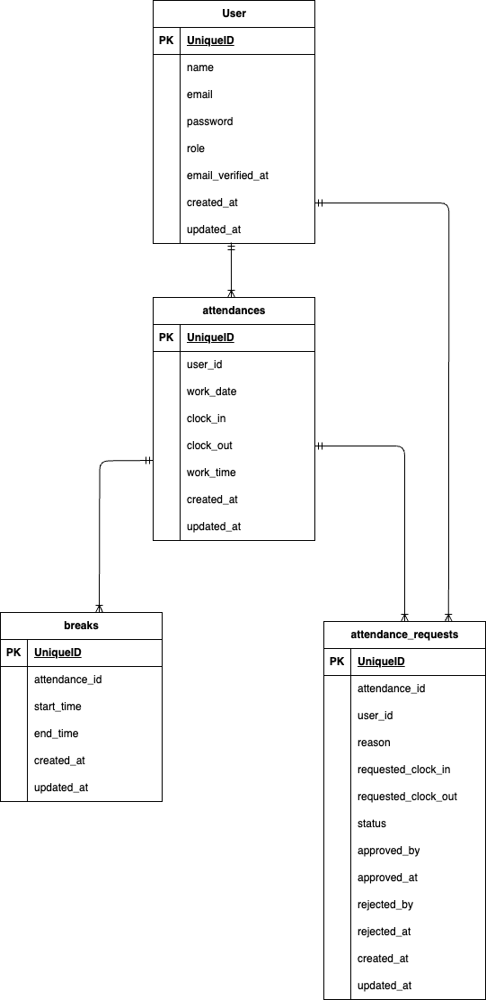

# 勤怠アプリ

## プロジェクト概要

サービス名：coachtech勤怠管理アプリ  
サービス概要：ある企業が開発した独自の勤怠管理アプリ  
制作の背景と目的：ユーザーの勤怠と管理を目的とする  
制作の目標：初年度でのユーザー数1000人達成  
ターゲットユーザー：社会人全般  
ターゲットブラウザ・OS：PC（Chrome/Firefox/Safari　最新バージョン）  

## 主要機能
・ユーザー登録/ログイン/ログアウト  
・勤怠登録（出勤/休憩/退勤）  
・勤怠修正申請  
・勤怠修正承認/却下（管理者）  
・勤怠一覧表示  

## 環境構築
Dockerビルド

1. git clone  git@github.com:yuri-tomabechi/attendance-app.git  
2. docker-compose up -d --build  

*MySQLは、OSによって起動しない場合があるのでそれぞれのPCに合わせてdocker-compose.ymlファイルを編集してください。  

Laravel環境構築

1. docker-compose exec php bash  
2. composer install  
3. cp .env.example .env  .env.exampleファイルから.envを作成し、DB設定を変更（下記参照）   
4. php artisan key:generate  
5. php artisan migrate  
6. php artisan db:seed  
7. php artisan storage:link

## データベース設定(.env)
DB_CONNECTION=mysql  
DB_HOST=mysql  
DB_PORT=3306  
DB_DATABASE=attendance_app  
DB_USERNAME=laravel_user  
DB_PASSWORD=laravel_pass  

## 使用技術
・フロントエンド：HTML/CSS/Blade/JavaScript  
・バックエンド： PHP/Laravel 8.83.8  
・データベース：MySQL  
・開発環境：Docker/Docker Compose  
・その他：Fortify/MailHog  

## URL
・開発環境：http://localhost  
・phpMyAdmin: http://localhost:8080/  

## ER図
  

